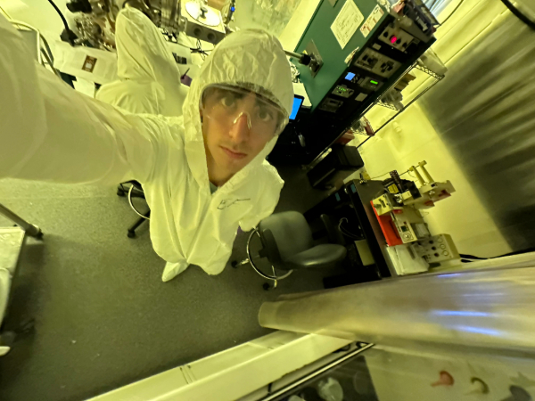
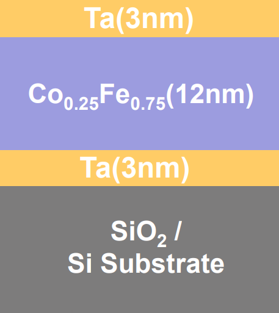
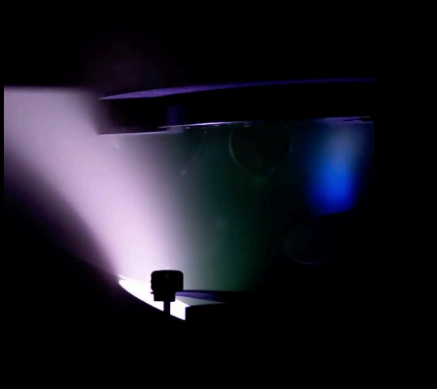

# Experimental Investigation of Magnetic Damping in Co–Fe Thin Films

Understanding and controlling [magnetic damping](https://journals.aps.org/prl/abstract/10.1103/PhysRevLett.102.137601){:target="_blank"} in ferromagnetic thin films is important for both spintronic technologies and emerging quantum information platforms. Magnetic damping determines how quickly a magnetic system loses energy and returns to equilibrium. Lower damping enables more efficient magnetic switching and longer-lived spin excitations, which are desirable for applications such as magnetic random-access memory (MRAM) and proposed skyrmion-based quantum devices.

My experimental research focuses on the fabrication and characterization of CoₓFe₁₋ₓ ferromagnetic thin films, a material system that has recently demonstrated unusually low magnetic damping for a metallic ferromagnet. These films are grown using DC magnetron co-sputtering, which allows precise control over film composition and thickness. In this work, cobalt and iron are co-deposited onto silicon substrates to produce films such as Ta/Co0.25Fe0.75/Ta trilayers, where the buffer and capping layers help stabilize the structure and influence the magnetic properties.

For the Ta/Co0.25Fe0.75/Ta trilayer studied here, the magnetic easy axis lies in the plane of the film, and the saturation magnetization of the 11.4 nm Co0.25Fe0.75 layer was measured to be approximately 1.69 × 10³ emu/cm³.

This work establishes a controlled materials platform for studying magnetic damping in metallic ferromagnets. Future experiments using ferromagnetic resonance (FMR) and time-resolved magneto-optical Kerr effect (TR-MOKE) will directly measure the damping parameter and help identify how film composition and interfaces influence magnetic relaxation processes.

---

### Images

  

*Figure 1: Left: Inside the cleanroom. Center: Diagram of the Ta/Co0.25Fe0.75/Ta trilayer structure. Right: DC magnetron sputtering chamber during deposition.*